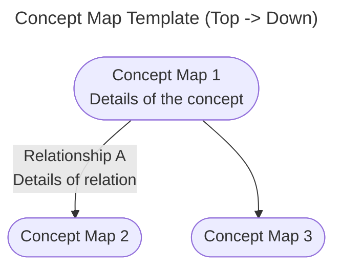
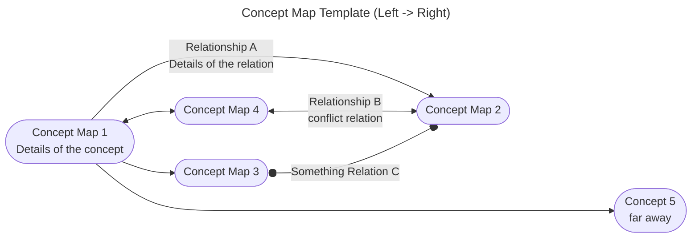

```mermaid
---
title: Concept Map Template (Top -> Down)
---
flowchart TD
    cp1(["Concept Map 1<br/> Details of the concept"]) -- "Relationship A<br/> Details of relation" 
    --> cp2(["Concept Map 2"])
    cp1 --> cp3(["Concept Map 3"])

```

```mermaid
---
title: Concept Map Template (Left -> Right)
---
flowchart LR
    cp1(["Concept Map 1<br/> Details of the concept"]) -- "Relationship A<br/> Details of the relation" 
    --> cp2(["Concept Map 2"])
    cp1 --> cp3(["Concept Map 3"])
    cp1 <--> cp4(["Concept Map 4"])
    cp4 <-- "Relationship B<br/> conflict relation" --> cp2
    cp3 o-- "Something Relation C" --o cp2
    cp1 ------> cp5(["Concept 5 <br/> far away"])
```