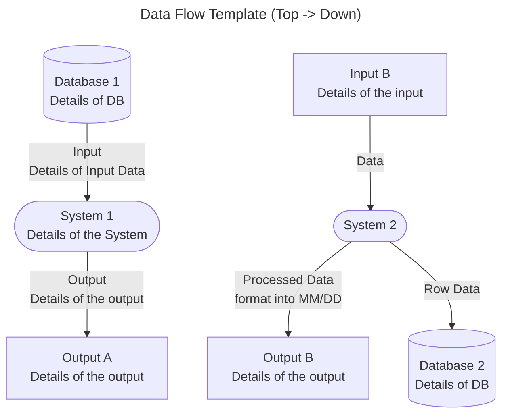
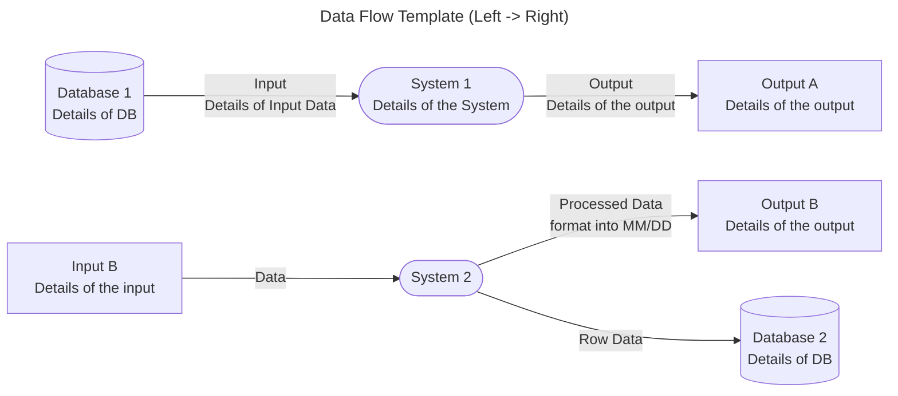

```mermaid
---
title: Data Flow Template (Top -> Down)
---
flowchart TD
    db1[("Database 1<br/> Details of DB")] -- "Input<br/> Details of Input Data" 
    --> sys1(["System 1 <br/> Details of the System"]) -- "Output <br/> Details of the output" 
    --> outA["Output A <br/> Details of the output"]
    inB["Input B <br/> Details of the input"] -- "Data" --> sys2(["System 2"])
    sys2 -- "Processed Data <br/> format into MM/DD" --> outB["Output B <br/> Details of the output"]
    sys2 -- "Row Data" --> db2[("Database 2<br/> Details of DB")] 

```

```mermaid
---
title: Data Flow Template (Left -> Right)
---
flowchart LR
    db1[("Database 1<br/> Details of DB")] -- "Input<br/> Details of Input Data" 
    --> sys1(["System 1 <br/> Details of the System"]) -- "Output <br/> Details of the output" 
    --> outA["Output A <br/> Details of the output"]
    inB["Input B <br/> Details of the input"] -- "Data" --> sys2(["System 2"])
    sys2 -- "Processed Data <br/> format into MM/DD" --> outB["Output B <br/> Details of the output"]
    sys2 -- "Row Data" --> db2[("Database 2<br/> Details of DB")] 
```